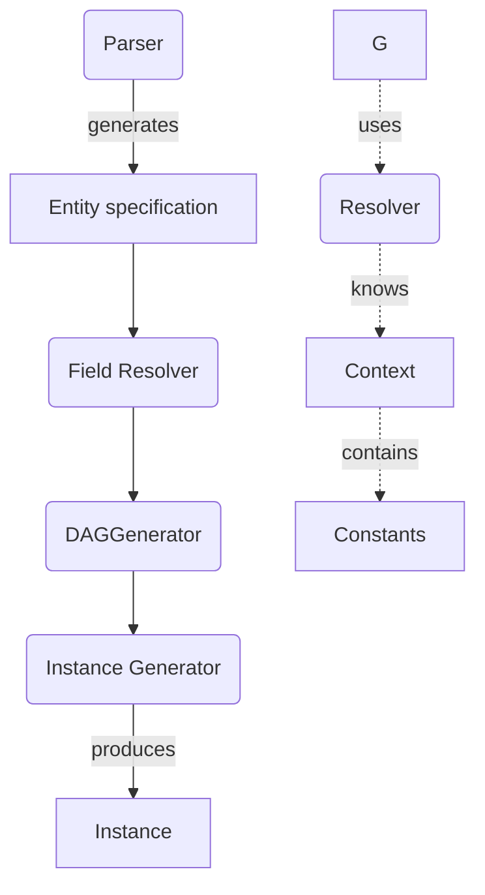
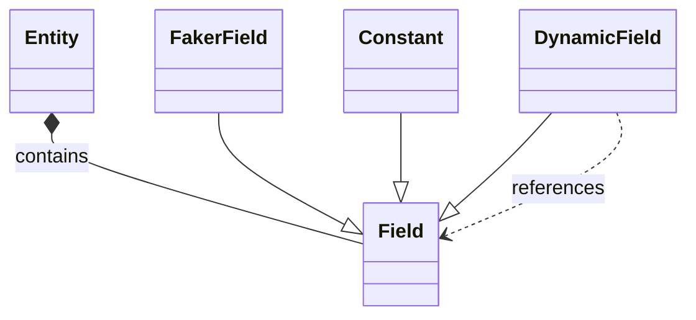

# Factory Boss

Fake entire data schemas. Easily.

Original repository: [https://github.com/mariushelf/factory_boss](https://github.com/mariushelf/factory_boss)

# Generation Process

## Entity Specification

## Instances

An instance is represented as a dictionary from field name to value.

# License

MIT -- see [LICENSE](LICENSE)

Author: Marius Helf ([helfsmarius@gmail.com](mailto:helfsmarius@gmail.com))

